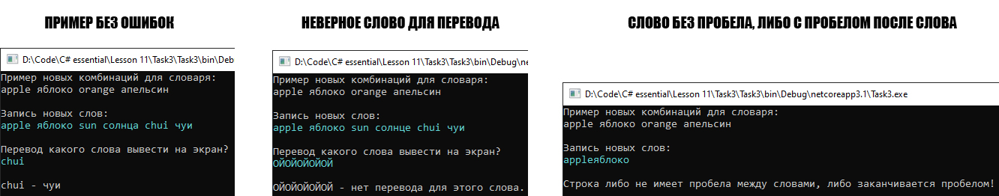

# Lesson11_task3
>Используя Visual Studio, создайте проект по шаблону Console Application.  
Создайте класс Dictionary<TKey,TValue>. Реализуйте в простейшем приближении возможность использования его экземпляра аналогично экземпляру класса Dictionary из пространства имен System.Collections.Generic. Минимально требуемый интерфейс взаимодействия с экземпляром, должен включать метод добавления пар элементов, индексатор для получения значения элемента по указанному индексу и свойство только для чтения для получения общего количества пар элементов.  

Подытог: вот такенный майндфак на выходе
>
